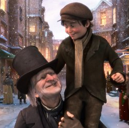

museum
======

I managed to recover a lot of the programs that I wrote during my high school days. Putting the more interesting of these into one repo shows a nice progression of my programming ability, I suppose. 

When these programs were written I had no formal training in programming. It's interesting to note that the biggest thing that has changed over time is simply naming conventions and program organisation. Most of the code is fairly readable and well indented. Unfortunately I didn't see much value in comments at the time

All of this code was written for Windows XP. Most of it still runs on newer versions of Windows I believe (all screengrabs were taken on Windows 7). All graphical examples use GDI and win32 API. I never got around to learning MFC or anything like that.

The following programs are ordered by last modification date of the final executable. A lot of the flicker in the gifs is due to a low framerate so as to keep the filesizes down. Where the actual program has lag or flickers a lot it will be noted. 

I have not spent any time making any of this code easy to compile as I don't expect anyone to want to actually compile any of it. It should all actually compile, though. I originally used Code::blocks or Dev-C++ with MinGW as my IDE.

#DeskDraw
####A program to draw on the desktop
####October, 2009

This program was (most likely) inspired by the new smartboards that our school installed. It also seems like it could be an interesting idea but I don't really remember ever finding this useful. I suppose it could be used where there is a projector without a touch screen but I should think there are probably better open source alternatives now.

Holding down the middle mouse button is used to draw.

I think basically how this is achieved is just by getting the device context of the dispay and then drawing on top of it.

There's not really a great deal to say about the functionality, it does what it says. I never got around to implementing erasing so the lines only go away when the window they are 'above' is updated. The lines also don't stay there when windows are moved around. I don't think it ever got finished because I realised I would never use it.

#Fake BSOD
####A fake blue screen of death as a prank
####October, 2009

I wrote this intended as a prank. I suppose in theory this is technically a trojan but it doesn't really do anything too nefarious. 
The program creates a fullscreen window modelled to look like a Windows blue screen of death. To exit the window (without using the task manager) a three-letter passcode can be set. Holding all three letters of this passcode will close the window. The default is T, I, M (creative, right?).

Funnily enough, a minute or two after taking this screenshot Windows gave me an actual blue screen of death. Maybe it works a little too well...

#BitmapInvert
####Applies some basic filters to bitmaps
#### November, 2009

This program just inverts/changes some channels of a bitmap image. From the looks of things the program works with both 8-bit and 24-bit bitmaps, which is suprising. I was fairly interested in image processing at the time and I think I also built a program to take a webcam feed and apply a (very basic) line filter to it. I haven't been able to find that one though.

The program is run from the command line and the desired filter is supplied there. Only one filter can be supplied per execution of the program but as it reads and writes complete bitmaps there is nothing stopping using multiple filters by running the program several times.

According to the inbuilt documentation the filters available are:
        i - Inverse Filter -- All pixels values take 255 - value.
	l - Left Shift -- All pixel values left shifted by 1.
        r - Right Shift -- All pixel values right shifted by 1.
	h - Halfway Filter -- Don't even ask 
	c - cycles RGB values for pixels -- Red value becomes blue, blue value becomes green, green becomes red.
	g - Greyscale -- Turns the image greyscale
	R/G/B - All Red/Green/Blue -- Eliminates two of the channels

These are some examples of applying filters to an image:

   

The first here is the original. The second looks inverted. The third looks like it has been made all blue. The fourth looks like it has been cycled left or right.

The most interesting thing here is just the manual reading/writing of bitmap files. Very little of this code is Windows dependent.

