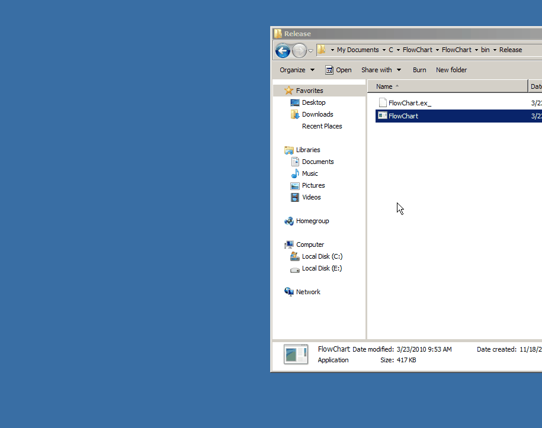

museum
======

I managed to recover a lot of the programs that I wrote during my high school days. Putting the more interesting of these into one repo shows a nice progression of my programming ability, I suppose. 

When these programs were written I had no formal training in programming. It's interesting to note that the biggest thing that has changed over time is simply naming conventions and program organisation. Most of the code is fairly readable and well indented. Unfortunately I didn't see much value in comments at the time

All of this code was written for Windows XP. Most of it still runs on newer versions of Windows I believe (all screengrabs were taken on Windows 7). All graphical examples use GDI and win32 API. I never got around to learning MFC or anything like that.

The following programs are ordered by last modification date of the final executable. A lot of the flicker in the gifs is due to a low framerate so as to keep the filesizes down. Where the actual program has lag or flickers a lot it will be noted. 

I have not spent any time making any of this code easy to compile as I don't expect anyone to want to actually compile any of it. It should all actually compile, though. I originally used Code::blocks or Dev-C++ with MinGW as my IDE.

(I used [ScreenToGif](https://screentogif.codeplex.com/) to record all of these gifs. It was exceptionally easy to use and well made. Don't let the quality of these gifs deter you from using it, I intentionally turned the quality way down.)

#DeskDraw
####A program to draw on the desktop
####October, 2009

This program was (most likely) inspired by the new smartboards that our school installed. It also seems like it could be an interesting idea but I don't really remember ever finding this useful. I suppose it could be used where there is a projector without a touch screen but I should think there are probably better open source alternatives now.

Holding down the middle mouse button is used to draw.

I think basically how this is achieved is just by getting the device context of the dispay and then drawing on top of it.

There's not really a great deal to say about the functionality, it does what it says. I never got around to implementing erasing so the lines only go away when the window they are 'above' is updated. The lines also don't stay there when windows are moved around. I don't think it ever got finished because I realised I would never use it.

#Fake BSOD
####A fake blue screen of death as a prank
####October, 2009

I wrote this intended as a prank. I suppose in theory this is technically a trojan but it doesn't really do anything too nefarious. 
The program creates a fullscreen window modelled to look like a Windows blue screen of death. To exit the window (without using the task manager) a three-letter passcode can be set. Holding all three letters of this passcode will close the window. The default is T, I, M (creative, right?).

Funnily enough, a minute or two after taking this screenshot Windows gave me an actual blue screen of death. Maybe it works a little too well...

#BitmapInvert
####Applies some basic filters to bitmaps
#### November, 2009

This program just inverts/changes some channels of a bitmap image. From the looks of things the program works with both 8-bit and 24-bit bitmaps, which is suprising. I was fairly interested in image processing at the time and I think I also built a program to take a webcam feed and apply a (very basic) line filter to it. I haven't been able to find that one though.

The program is run from the command line and the desired filter is supplied there. Only one filter can be supplied per execution of the program but as it reads and writes complete bitmaps there is nothing stopping using multiple filters by running the program several times.

According to the inbuilt documentation the filters available are:

	* i - Inverse Filter -- All pixels values take 255 - value.
	* l - Left Shift -- All pixel values left shifted by 1.
	* r - Right Shift -- All pixel values right shifted by 1.
	* h - Halfway Filter -- Don't even ask 
	* c - cycles RGB values for pixels -- Red value becomes blue, blue value becomes green, green becomes red.
	* g - Greyscale -- Turns the image greyscale
	* R/G/B - All Red/Green/Blue -- Eliminates two of the channels

These are some examples of applying filters to an image:

   

The first here is the original. The second looks inverted. The third looks like it has been made all blue. The fourth looks like it has been cycled left or right.

The most interesting thing here is just the manual reading/writing of bitmap files. Very little of this code is Windows dependent.

#Padman
#### A Pacman clone for the ClassPad calculator
#### January, 2010

The ClassPad calculator was a pretty nifty CAS graphics calculator with a large screen and a touch screen. I don't think it was nearly as popular as the TI calculators so there weren't very many games available for it (maybe 10-20 that I could find at the time). Pacman was a pretty obvious choice to build because it offered more complexity than I was used to and the dimensions of the screen are perfect for it. The game ended up having about ten levels, one of which was designed by a friend.

This was one of my first ventures into C++ so the code is pretty horrendous and impossible to follow. The windowing system of the ClassPad (PEG) was also new to me and so was another thing to learn.

This shows the very first level (which is an exact clone of the original Pacman level). There was a menu with options and credits but I must have removed that for this version for some reason. Unfortunately the PC emulation crashes on button presses but the version that runs on the actual calculator worked fine and was bug tested and finished. This was probably one of the first non-trivial programs I ever wrote that I would really consider complete. I remember this taking me a long time. I think I worked on and off for a few months on it.

The AI is somewhat notable I suppose. From memory it uses a recursive algorithm to search the entire maze for the most efficient path to player. Unfortunately that would be too perfect, though, so it will only update this path once it travels half the tiles toward the player. This means that it is always travelling to where the player was several tiles ago until it is right next to the player where it will directly follow the player.

The power pills are also sort of interesting. The ClassPad is only black and white (no greyscale) and there needed to be a way to indicate that the ghosts could be eaten. To implement a 'pseudo grayscale' the ghosts are only rendered on every second or third frame when a powerpill has been eaten. This idea is essentially the same as PCM used to make lights look dimmer.

#DeskPOP
#### The Prince of Persia running along the bottom of the desktop.
#### February, 2010

This is a program that renders the Prince of Persia sprite from the original game running along the bottom of the desktop. Once he reaches the edge of the screen he will turn around and run the other way.

There was always a lot of flicker in the program. It did work fairly well in Windows XP though. Windows 7 completely broke it and he is hardly visible. Funnily enough I was only able to see him running when he was being screengrabbed. I always thought this was a pretty cool idea and it's disappointing that I never got a reliable version working.

#TicTacToe
#### A simple tic tac toe game
#### March, 2010

A very simple tic tac toe game for windows. I think I wanted to make this so that I could build an AI for it. From memory I never actually got an unbeatable AI working (I wanted to develop the algorithm myself so no minimax used) but I wasn't able to beat it when I was taking the screengrab. Maybe I just suck at Tic Tac Toe.

The mouse is really difficult to see here. That's an artifact of the screengrabbing software that I used. I am the Xs and the AI is the Os.

#ListWindows
#### Lists ALL of the windows on the system
#### March, 2010

I used to be pretty interested in how Windows worked. I made this program to list all of the windows on the system and manipulate them in some pretty basic ways. Listing all the windows means that even child windows are listed.

This just provides a cool example of how to enumerate all windows on a system.

#FlowChart
#### A small program for building flow charts
#### March, 2010

I started taking WACE Computer Science at high school in 2010. We didn't really do any significant programming in the unit but we had to draw flowcharts for some flow control exercises. I went home and wrote a program to make drawing flowcharts easier.

Unfortunately the program does not actually support the lines between steps in the flowchart, these have to be drawn in afterwards. I think I only ended up using this program once or twice before we moved on and I never used flowcharts ever again.

#16 Puzzle
#### The popular 16 slider puzzle
#### March, 2010

We had Windows 7 installed on the school computers at about this time and I really enjoyed the 16 puzzle widget that came with it (I realise that the puzzle itself is actually quite old). I decided to build the widget for Windows XP.

For some reason I never actually got around to mixing the puzzle up. I think this is because it's not quite as trivial as it seems because if you just set random blocks to random numbers then you can create an unwinnable state. The easiest way to do it is just to create the board and then mix it up by randomly moving tiles around.

#Juggle
#### A juggling game
#### March, 2010

This is a quick little game based on a flash game that I played once. The objective is to move your paddle using the mouse to keep the balls bouncing. After enough balls are juggled without missing any a new ball is added. This goes on til about ten balls (I think).

The animation here is surprisingly very smooth (the flickering is due to the screengrab). It turned out to be quite a fun game and I was happy with myself when I completed it. The gravity also looks quite good.

#Fractals
#### April, 2010

I became kind of interested in simple fractals around this time. I made a few programs to generate them.

#### Sierpinski Carpet

This is like the sierpinski triangle but with squares.

#### Sierpinski Triangle

The more well-known sierpinski triangle.

#### Tree fractals

I don't remember if I came up with this or if I read about it somewhere. Trees are self similar in that the branches very much resemble the structure of the whole tree.

Funnily enough I used this fact to generate three dimensional trees in my povray assignment (see my Newton's Cradle repo) and in an opengl assignment that I had to complete.

The parameters were easily changed in code here to generate a lot of different looking trees. The one generated here is just the parameters that I set several years ago.

#Slime Volleyball
#### A clone of the popular slime volleyball online game
#### April, 2010

The slime volleyball online game is great fun and I used to play it all the time. I thought it would be an interesting game to try and clone. I got something that at least resembled the game but I never managed to get the physics right.

The controls are the arrow keys for the second player and numpad 1, 3 and 5 for the first player (worst decision I have ever made). The above gif doesn't really show the extent of the broken physics in the clone. There is some flicker in the program but it's not too bad, the gif exacerbates it quite a bit.

#Raycasting Test
#### A small raycasted environment
#### April, 2010

This was probably about the time when I read David Kushner's Masters of Doom. Masters of Doom is the story of the rise of id Software. After reading about DOOM and Wolfenstein3D I became pretty interested in raycasting. This was an attempt at a small raycasted environment that the player can walk through. The environment is just a room with some boxes. 

Unfortunately I don't think I got the maths to work out so there are a lot of gaps everywhere. The movement also flickers a lot which is either because GDI sucks or I suck, I'm not sure which.

#Colour Picker
#### May, 2010

We were given an assignment in our WACE computer science class to design an application to help pick colour schemes. I decided to actually build said application to stave off boredom.

#### My Application

My design made absolutely no sense at all. My goal was to have some colour 'patches' that could be moved around and fitted next to each other. I suppose the idea was based off of the patches that you get shown when choosing paints at a store. I never got around to finishing it but I thought the movement of the hexagons looked cool.

#### Another Application

I offered to build the application that a friend of mine in the same class had designed. His design was much better than my own and it came out a lot nicer. The idea is just to select from a palette and the colours will show up next to each other.

I think that the colours in the palette are just randomly generated. I think it came out quite nicely.

